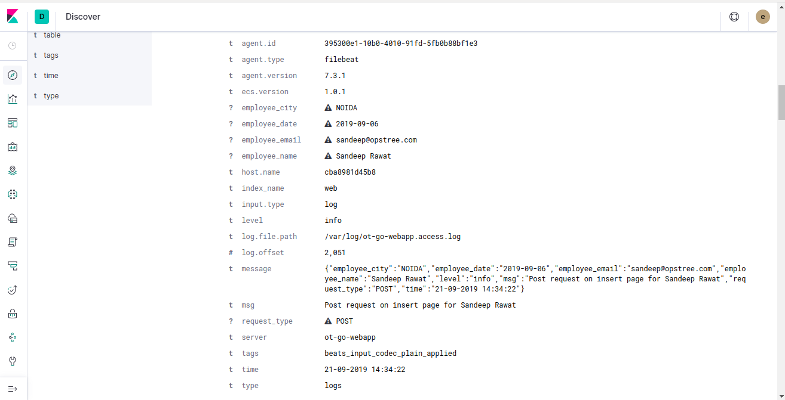
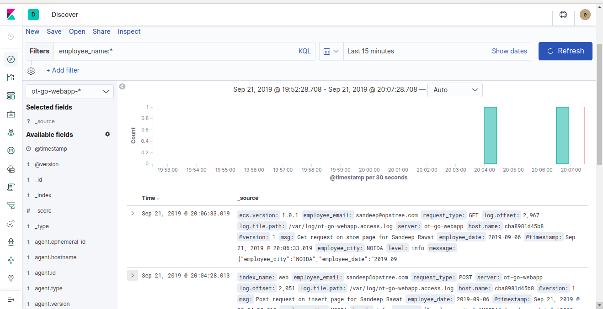

# Opstree-Go-WebApp

The main goal of creating this sample Golang application is to provide an environment and idea of Golang Application's **build**, **test** and **deploy** phase.

**The application looks likes this:-**


## Requirments

- **[Golang](https://golang.org/)** ---> For development environment
- **[Docker](https://www.docker.com/)** ---> For dockerizing the application
- **[Dep](https://github.com/golang/dep)** ---> For Golang dependency management

## Overview

OT Go-App is a CRUD application which provides a Web UI Interface for Employee Management. As a functionality wise it provides:- 

- Web UI interface for employee management
- It stores all the data in MySQL database
- It provides functionality of auto-reconnection of database
- Generates log file for access log and error in */var/log*
    - Access logs will lies in `/var/log/ot-go-webapp.access.log`

    - Error logs will lies in `/var/log/ot-go-webapp.error.log`

- We can pass the database credentials via properties file or environment variables
- For properties file we have to store `database.properties` at this location `/etc/conf.d/ot-go-webapp/application.ini` and the content should be something like this :-

```ini
[database]
ENABLED     = true
DB_URL      = 172.17.0.3
DB_PORT     = 3306
DB_USER     = root
DB_PASSWORD = password

[redis]
ENABLED    = true
REDIS_HOST = 172.17.0.4
REDIS_PORT = 6379
```

- For environment variables we have to set these environment variables
    - **DB_USER** ---> Name of the database user
    - **DB_PASSWORD** ---> Password of the database user
    - **DB_URL** ---> URL of the database server
    - **DB_PORT** ---> Port on which database is running
    - **ENABLED** ---> Enable redis for caching or not
    - **REDIS_HOST** ---> URL of the redis server
    - **REDIS_PORT** ---> PORT of the redis server

- There is health check url also available at /health, which provides the information that application is healthy or not


**Important:- In MySQL database should exist with name employeedb**

## Directory Layout

The folder structure of the codebase looks like this:-

```s
ot-go-webapp
├── Dockerfile        ---> Dockerfile to dockerize the complete application
├── Gopkg.lock        ---> Automated generated file by dep dependency manager
├── Gopkg.toml        ---> Automated generated file by dep dependency manager
├── main.go           ---> Main function file to call all the function
├── main_test.go      ---> Test case for main function calling
├── README.md         ---> The file which you are going through right now
└── webapp            ---> Actual codebase for webapp folder
    ├── main.go       ---> Main file for calling webapps functions
    ├── main_test.go  ---> Main webapp test cases file
    ├── redis.go      ---> This file holds all the 
    ├── redis_test.go ---> Test cases for redis caching functionalities
    ├── sql.go        ---> This file holds all the sql functionalities related stuff
    ├── sql_test.go   ---> Test cases file for sql functionalities
    └── template.go   ---> This file has the HTML template for Web Interface
```

## Monitoring Application

We have integrated ELK(Elasticsearch, Logstash, and Kibana) for application log monitoring example. The main motive for this to encourage people to use JSON logging because field separation is quite easy in JSON. If you hate writing grok patterns this feature could be your lifesaver.

In addition you will get these beautiful logs visualization





## Building Application

#### For non-dockerized environment

This webapp is written in go so it builds the application in the form of binary. For downloading the dependency through dep:-

```shell
dep ensure
```

If you are not using the dep use go for downloading the dependency but there is a fallback in this, you will not get the exact version :stuck_out_tongue_winking_eye:

```shell
go get -u ./...
```

After downloading the dependency only thing left is building it, for which we can use simple golang command line

```shell
go build
```

#### For dockerized environment

For dockerized environment just run:-

```shell
docker build -t opstreedevops/ot-go-webapp:latest -f Dockerfile .
```

## Running Application

#### For non-dockerized environment

First we have to create a database in MySQL

```sql
CREATE DATABASE IF NOT EXISTS employeedb;
```

Once the database is created, create a properties file or set environment as given above and then execute the binary

```shell
./ot-go-webapp
```

Now you will be able to access the app at http://<your_server_ip>:8080/ and health url at http://<your_server_ip>:8080/health

#### For dockerized environment

First we have to run the mysql and redis container

```shell
docker run -itd --name mysql -e MYSQL_ROOT_PASSWORD=password -e MYSQL_DATABASE=employeedb mysql:5.6
docker run -itd --name redis redis:latest
```

Once the mysql container is created, we have to start the application

```shell
docker run -itd --name application --link mysql:mysql -e DB_USER=root -e DB_PASSWORD=password -e DB_URL=mysql -e DB_PORT=3306 -e REDIS_HOST=redis -e REDIS_PORT=6379 opstreedevops/ot-go-webapp:latest
```

## To Do
- [X] Implement logging
- [X] Add more fields for employee
- [X] Write unit tests
- [X] Fix code if there is any mess
- [X] Integrate dependency management
- [ ] Fill README with more information
- [X] Make application more attractive
- [X] Add healthcheck API
- [X] Add redis healthcheck
- [X] Logging of acccess and error log
- [ ] Provide file uploading functionality
- [X] Integrate redis for caching purpose
- [ ] Dump manifests file for kubernetes deployment
- [X] Replace property file from ini structure file
- [ ] Structure code in better manner(Refactoring)
- [X] Implement json logging
- [ ] Add docker compose setup
